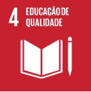
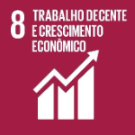

  <a href="#sobre">Sobre</a>  |  
  <a href="#publico">Publico</a>  |
  <a href="#sprints">Sprints</a>  |
  <a href="#backlog">Backlog</a>  |  
  <a href="#prototipo-e-documentação">Protótipo & Documentação</a>  |  
  <a href="#tecnologias-utilizadas">Tecnologias</a>  |  
  <a href="#equipe">Equipe</a>

## 📌 Status do Projeto : Em andamento

## 📖 SOBRE O PROJETO

Athena.dev é uma plataforma web que disponibiliza jogos e desafios interativos para o aprendizado prático de programação front-end. A proposta central é tornar a jornada de aprendizado mais acessível, divertida e eficaz por meio de gamificação. As atividades incluem o "Jogo dos Sete Erros" (encontre erros em códigos), "Duelo PVP" (corrida para replicar páginas) desafios (resolva os problemas exibido) , que ajudam a reforçar conceitos de lógica, boas práticas e criação de layouts. Com base em desempenho, os usuários ganham pontos e podem subir em um ranking, promovendo competitividade saudável.

## 📙 ESCOPO

O projeto Athena.dev tem o desenvolvimento de uma plataforma web educacional que proporciona o aprendizado de programação front-end de forma gamificada. O sistema oferece desafios, jogos e funcionalidades que simulam problemas reais enfrentados por desenvolvedores, com foco em treinar lógica, estrutura de código e boas práticas.

## 📕 METODOLOGIA

 Usamos a prática de desenvolvimento ágil (Scrum e Kanbam) para que pudéssemos ter mais flexibilidade e facilidade em se organizar. A documentação foi sendo feita em paralelo com o desenvolvimento do projeto, para que estivéssemos sempre atualizando. 

## 👥 IDENTIFICAÇÃO PÚBLICO ALVO

Nosso público-alvo é composto por Estudantes, jovens, autodidatas e educadores que buscam um método dinâmico e gamificado para aprender programação, estimulando o raciocínio lógico e a prática constante.

## 📚 DIAGRAMA DE CLASSES

## 📗 REQUISITOS FUNCIONAIS 

## 📕 REQUISITOS NÃO FUNCIONAIS

## 🎯 **Objetivos de Desenvolvimento Sustentável (ODS)**
O software projetado é uma ferramenta web que disponibiliza jogos e desafios, onde o programador poderá desenvolver a lógica e boas práticas de forma lúdica, através de atividades como: Jogo dos sete erros (encontrar erros no código) e Duelo PVP (onde o jogador tentará copiar a página o primeiro que seu adversário). Através de desafios, o usuário poderá ganhar pontos e desta forma acumular e subir sua posição em um ranking que pode, posteriormente, proporcionar de alguma forma uma recompensa. 

Sendo assim, o objetivo do projeto é treinar os interessados em melhorar suas habilidades de programação. 

ODS 4

4. Educação de qualidade:  Serão proporcionados recursos (documentações e posteriormente aulas e videoaulas) que serão guias para estudos. 

ODS 8

8. Trabalho decente e crescimento econômico: Ao proporcionar uma melhor educação e o acesso a ela, o projeto visa promover as condições sociais econômicas dos usuários. 

ODS 9

9. Indústria, inovação e infraestrutura: O site também busca agregar no conhecimento, criatividade e inovação, através de interações entre usuários e atualizações do mundo da tecnologia. 

## 📅 ENTREGA DAS SPRINTS

<table>
  <tr>
    <th>Sprint</th>
    <th>Período</th>
    <th>Entregas</th>
    <th>Status</th>
  </tr>
  <tr>
    <td>Sprint 1</td>
    <td>01/02 - 01/03</td>
    <td>novos requisitos e itens que irão ser adicionados ou atualizados</td>
    <td>✅ Concluído</td>
  </tr>
  <tr>
    <td>Sprint 2</td>
    <td>01/03 - 31/03</td>
    <td>Criação do Back-End </td>
    <td>✅ Concluído</td>
  </tr>
  <tr>
    <td>Sprint 3</td>
    <td>01/04 - 15/06</td>
    <td>Finalização do Back-End e início da integração</td>
    <td>🟡 em andamento</td>
  </tr>
  <tr>
  <tr>
    <td>Sprint 4</td>
    <td>01/06 - 30/06</td>
    <td>Fase de teste final, documentação pronta e projeto integrado e funcionando</td>
    <td>🟡 A iniciar</td>
  </tr>
</table>

## 💻🖥️ DEMONSTRAÇÃO DAS TELAS

## 📅 GERENCIAMENTO DE CRONOGRAMA 

## 📚 BACKLOG

## 🖥️ PROTÓTIPO E DOCUMENTAÇÃO

> 🔗 **Links das documentações** 

> -[📄 Visualizar PDF da documentação](https://github.com/konsanii/figma-imagem-Pallas/blob/main/Pallas-Athena.dev-DOC.pdf)

## 🛠️ TECNOLOGIAS UTILIZADAS

  
  
  
  
  
  
  
  
  
  
  
  

## 👥 EQUIPE

<table>
  <thead>
    <tr>
      <th>Nome</th>
      <th>Função</th>
      <th>GitHub</th>
    </tr>
  </thead>
  <tbody>
    <tr>
      <td>Eduardo Kamo</td>
      <td>Diretor Executivo (CEO)
Guiando a empresa para  um futuro mais facil e incrivel!</td>
      <td>
        
      </td>
    </tr>
    <tr>
      <td>Iago Yuri Rossan</td>
      <td>Diretor de TI (CIO)
Atuando no desenvolvimento de novas telas de aplicação
</td>
      <td>
        
      </td>
    </tr>
    <tr>
      <td>Lucas Vinicios Consani</td>
      <td>Analista de TI
Atuando dando suporte para o sistema</td>
      <td>
        
      </td>
    </tr>
    <tr>
      <td>Matheus Nery</td>
      <td>Diretor de Marketing Digital Atuando para engajar a midia visual da empresa</td>
      <td>
        
      </td>
    </tr>
    <tr>
      <td>Nelson de Oliveira</td>
      <td>Diretor de Operações (COO) Atuando na solução de conflitos e processos</td>
      <td>
        
      </td>
    </tr>
  </tbody>
</table>

# Pallas

This project was generated with [Angular CLI](https://github.com/angular/angular-cli) version 18.2.2.

## Development server

Run `ng serve` for a dev server. Navigate to `http://localhost:4200/`. The application will automatically reload if you change any of the source files.

## Code scaffolding

Run `ng generate component component-name` to generate a new component. You can also use `ng generate directive|pipe|service|class|guard|interface|enum|module`.

## Build

Run `ng build` to build the project. The build artifacts will be stored in the `dist/` directory.

## Running unit tests

Run `ng test` to execute the unit tests via [Karma](https://karma-runner.github.io).

## Running end-to-end tests

Run `ng e2e` to execute the end-to-end tests via a platform of your choice. To use this command, you need to first add a package that implements end-to-end testing capabilities.

## Further help

To get more help on the Angular CLI use `ng help` or go check out the [Angular CLI Overview and Command Reference](https://angular.dev/tools/cli) page.
